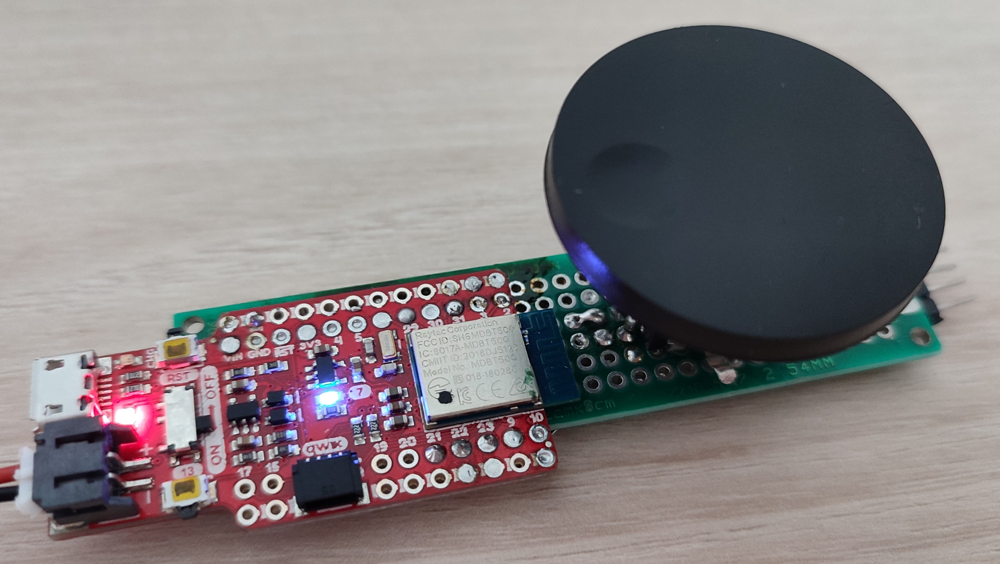

# ble-volume-controller
This is a Bluetooth device used to control the volume or to scroll a document on a PC.
The device has two modes of operation:
- Media remote, can control the volume and pause the media player
- Scroll remote, can scroll the active document



## How to use
After the device is conencted to the PC over bluetooth the rotary button can be used to send commands depending on the active mode of opeartion.

Media remote:
- Rotate left: decrease volume
- Rotate right: increase volume
- Press: Pause/Resume media

Scroll remote:
- Rotate left: scroll down
- Rotate right: scroll up

Active mode is shown by the blue led, `on` for media remote and `off` for scroll remote or `blinking` when the device waits for connection.

## How it works
The device presents itself as a composite HID device capable of sending mouse and media player related data.

The encoder direction is read by nRF52840 using the quadratic decoder connected at pins no 23 and 22.

## How to compile
You will need vscode and docker to compile the firmware. Make sure to install recomanded plugins.

1. Install docker
2. Press 'Build docker image' from bottom bar
3. Press 'Run docker'
4. Press 'Build'
5. Press button 13 and RST, release RST while keeping button 13 pressed to enter bootloader
6. Press 'Flash' to flash the firmware

## Schematic
```
+----------------------------+
|                            |       +-------+
|                          23+-------+A      |
|                            |       |GND    |
|                          22+-------+B      |
|                            |       |       |
|                          21+-------+Switch |
|                            |       +-------+
|                            |        Encoder
|                            |
|                            |        +----+
|                          2 +--------+Tx  | 
|                            |        |    |
+----------------------------+        |GND |
SparkFun Pro nRF52840 Mini            +----+
                                       Debug
```
